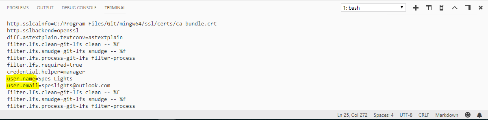

# **Game Day Assignments 2018 Week 34 Day 05**

### Game Day 08

### **Date:** August 24th 2018

### **Codename:** Project Memento

### Memento is the name of the movie where the guy suffers from amnesia and uses tatoos and notes to kill the guy that killed his wife which is the last thing he remembers. 

___

## **Assignee** 

@acesilverlight

@britanozovial

@ivydaredevil

## **Assignments**

1. ### Create a repository named "memento" on your computer. Create a workspace for this repository as well. Push the repository to your Github profile. All commits should be pushed to Github as well. 

2. ### Your initial commit should contain a screenshot named "config-list" using the snipping tool. This screenshot should be the terminal output of the configuration list for the "memento" repository focused on "user.name" and "user.email". See below for example:

3. ### Your second commit message should be "Self Identity". Your commit author name and email should be your Github profile name and email. The second commit should contain the following files: `restart.js` and `rebirth.js`. Enter something into these files. It could be anything but you should enter something in them. 

4. ### Your third commit message should be "James Bond" Your commit author name and email should be `James Bond` for author and `jamesbond007@github.com` for email. The third commit should contain only two files: `mission.js` and `protocol.js`. Enter something into these files. It could be anything but you should enter something in them. 

5. ### Your fourth commit message should be "Ghost". Your commit author name and email should be `Ghost` for author and `ghost@github.com` for email. The fourth commit should contain only one file: `ghost.js`. Enter something into this file. It could be anything but you should enter something in them. 

