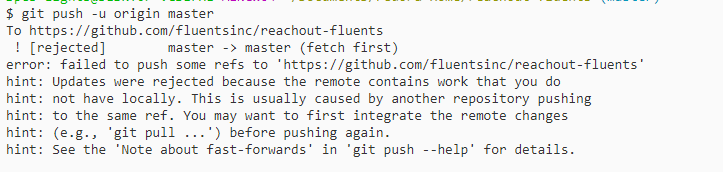

# **Game Day Assignments 2018 Week 35 Day 04**

### Game Day 13

### **Date:** August 30th 2018

### **Codename:** Project Fix Major Fuckup


___

## **Assignee** 

@acesilverlight

@britanozovial

@ivydaredevil

## **Assignments**

1. ### Add `achilleshelenatroy` as a collaborator to the "reachout-your-last-name" repository you had created. You should grant access by the time specified: 

```
@britanozovial - 0620
@acesilverlight - 1750
@ivydaredevil - 1520

```

2. ### Create two commits on your "reachout-your-last-name" repo and push the commits to Github. You should post a similar screenshot to gameday-screenshots like the one you see below: 



3. ### Solve the above error so that your "reachout-your-last-name" repository on Github contains the commits you had created in experiment-#2 